# 📝 Memo Web (LocalStorage 지원)

리액트(React) + 타입스크립트(TypeScript)로 만든 간단한 메모장 웹 애플리케이션입니다.  
메모를 추가하고 삭제할 수 있으며, **로컬스토리지(LocalStorage)**에 저장되어 페이지를 새로고침해도 데이터가 유지됩니다.

---

## 🚀 프로젝트 소개

이 프로젝트는 로컬 환경에서 동작하는 **메모 관리 웹**입니다.  
`React`와 `TypeScript`를 사용하여 컴포넌트 기반 구조를 구현하고, `localStorage`를 이용해 데이터를 브라우저에 저장합니다.

---

## 🧩 주요 기능

- ✏️ 메모 추가 (제목 + 내용)
- 🗑️ 메모 삭제
- 🧼 입력 초기화 버튼
- 💾 로컬스토리지에 메모 자동 저장

---

## 🛠️ 기술 스택

| 분류           | 사용 기술         |
| -------------- | ----------------- |
| **Frontend**   | React, TypeScript |
| **Styling**    | CSS               |
| **Storage**    | LocalStorage      |
| **Build Tool** | Vite              |

---

## 📂 폴더 구조

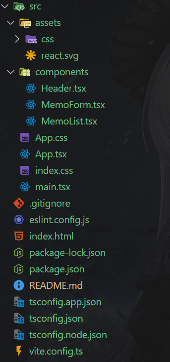

---

## 🖥️ 웹 화면


### ✏️ 메모 작성 화면

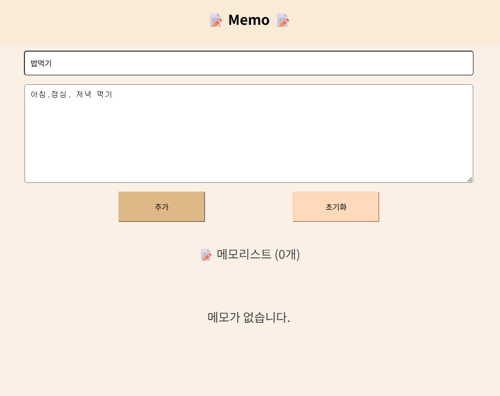

### 🗒️ 메모 리스트 화면 (삭제,추가)

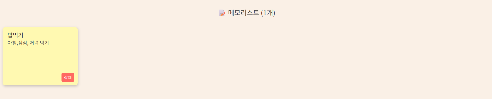

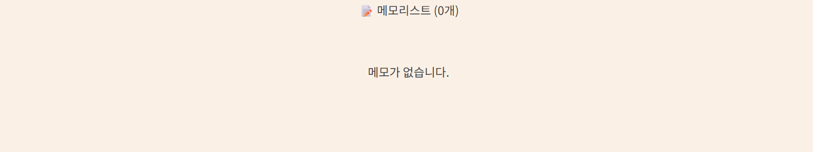

## 📝 메모 리스트 화면 (수정 버튼, 라벨, 작성 시간 표시)

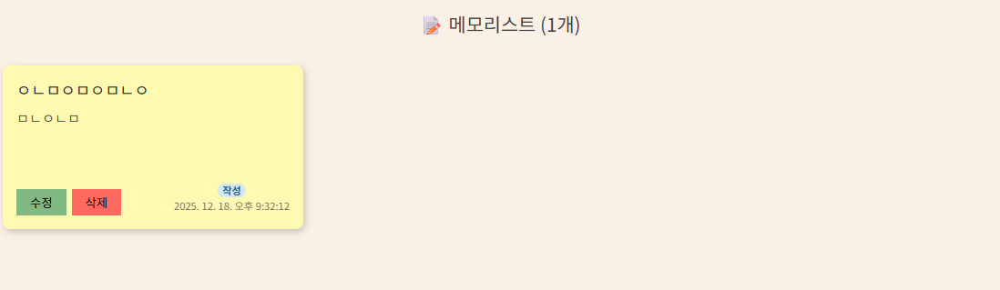

### ✏️ 메모 수정 화면 (메모 수정 화면, 수정 시 라벨 변경 [작성 => 수정])

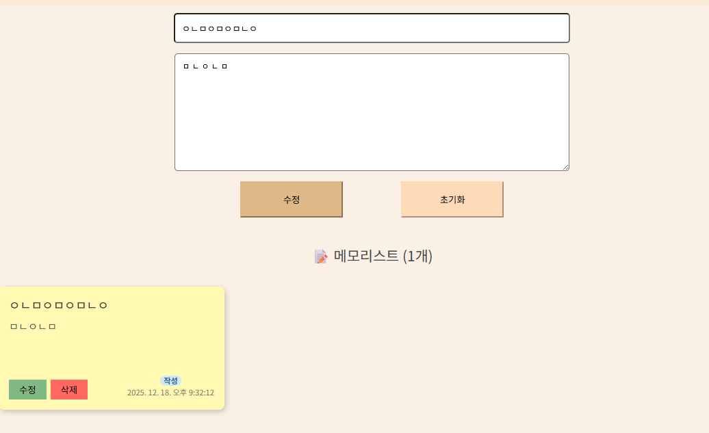
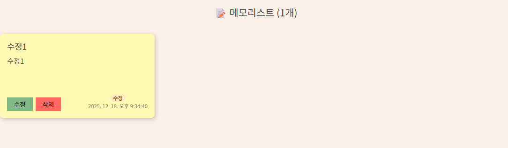

### 🔔 메모 알림 (Toast 활용)

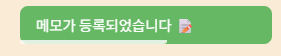

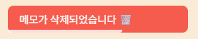

### 🌙 다크 모드 화면

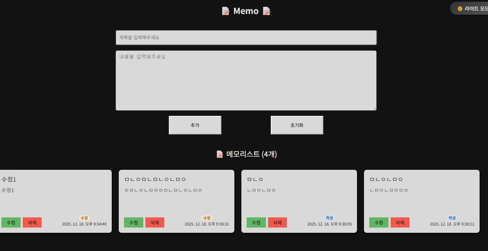

### 🌙 반응형 페이지

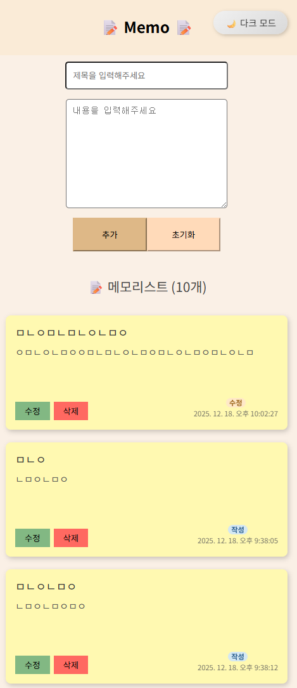

## ⚙️ 실행 방법

### 1️⃣ 의존성 설치

```bash
npm install
```

### 2️⃣ 개발 서버 실행

```bash
npm run dev
```

### 3️⃣ 브라우저 열기

```bash
http://localhost:5173

```

> ⚠️ 포트 번호는 환경에 따라 다를 수 있습니다.

## 💡 개선 아이디어

- [x] 메모 추가, 삭제 브라우저 알림 기능 추가
- [x] 메모 수정(Edit) 기능 추가
- [ ] 메모 검색 및 필터 기능
- [x] 다크 모드 / 반응형 디자인 적용
- [x] 메모 작성 시간 표시
